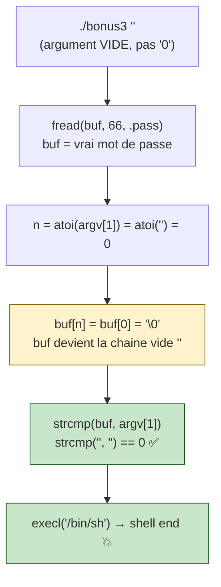

# Bonus3 — Walkthrough

> **En résumé :** `main` lit le mot de passe `/home/user/end/.pass` dans `buf`,
> puis fait `buf[atoi(argv[1])] = '\0'` (on contrôle **où** planter le `\0`),
> puis compare `strcmp(buf, argv[1])`. Si égal → `/bin/sh`. On ne connaît pas le
> mot de passe, mais en passant une **chaîne vide** `""` : `atoi("") = 0` →
> `buf[0] = '\0'` → `buf` devient `""`, et `argv[1]` est aussi `""` →
> `strcmp("", "") == 0` → shell `end`. **C'est le dernier niveau.**

> ℹ️ **Pas de débordement ici** : la faille est purement **logique**. On ne fait
> rien déborder, on exploite le fait qu'on contrôle l'indice de troncature ET
> l'un des deux opérandes du `strcmp`.

## Le process de l'exploit



## Le raisonnement, étape par étape

On ne peut **pas** deviner le mot de passe. Mais on contrôle deux choses :

1. **l'indice** où le `\0` est planté : `n = atoi(argv[1])`
2. **la chaîne** comparée à `buf` : `argv[1]` lui-même

L'idée : rendre `buf` **égal à `argv[1]`** sans connaître le mot de passe. La
seule valeur d'`argv[1]` qui produit un `buf` qu'on peut **prédire**, c'est la
chaîne vide.

```
argv[1] = ""
   ├─ atoi("") = 0        → n = 0
   ├─ buf[0] = '\0'       → buf = ""   (coupé dès le 1er octet)
   └─ argv[1] = ""        → ""
                strcmp("", "") == 0  → égal → shell
```

### Pourquoi `buf` "vaut" la chaîne vide

En C, une chaîne s'arrête **au premier `\0`**. Les octets du mot de passe sont
toujours en mémoire, mais plus personne ne les lit :

```
buf = [ '\0' 'b' 'f' '9' ... le mot de passe ... ]
         ↑
   strcmp s'arrête ICI → buf "vaut" ""  (rien avant le \0)
```

### Pourquoi `"0"` ne marche PAS (piège classique)

```
argv[1] = "0"
   ├─ atoi("0") = 0   → buf[0] = '\0'  → buf = ""   ✅ (buf bien vidé)
   └─ argv[1] = "0"                    → "0"
                strcmp("", "0") != 0   → PAS égal → puts(out) → raté ❌
```

`atoi("0")` et `atoi("")` valent **tous les deux 0** (donc `buf` est vidé dans
les deux cas), MAIS l'argument lui-même diffère : `"0"` n'est pas vide. Il faut
que **les deux côtés** du `strcmp` soient vides → seul `""` convient.

## La branche `puts(out)` est un cul-de-sac

En testant `./bonus3 54`, `67`, `68`… tu obtiens juste une **ligne vide**, jamais
un bout du mot de passe. Pourquoi :

```
.pass ≈ 65 octets  ( mot de passe + \n )

fread(buf, 1, 0x42, f)  -> veut 66 o. → lit TOUT le fichier → curseur à EOF
fread(out, 1, 0x41, f)  -> part de EOF → lit 0 octet → out reste tout à ZÉRO
puts(out)               -> affiche une chaîne vide
```

`out` ayant été mis à zéro au début et le 2ᵉ `fread` ne lisant rien (EOF), `out`
reste vide. **Le mot de passe n'est jamais affiché par cette branche** — le seul
chemin gagnant est le `strcmp`.

## Exécution

```bash
bonus3@RainFall:~$ ./bonus3 ""
$ whoami
end
$ cat /home/user/end/.pass
```

> Astuce shell : si `./bonus3 ""` te laisse un prompt `$` minimaliste, c'est bon —
> tu es dans le `sh` lancé par `execl`. Tape `whoami` pour confirmer `end`.

Résultat → shell aux droits de **end** (utilisateur final du wargame 🏁).

## Pièges rencontrés (et comment on les a résolus)

| Symptôme | Cause | Fix |
|---|---|---|
| `puts` affiche une ligne vide quel que soit l'argument | `.pass` fait ~65 o. → le 1ᵉ `fread(66)` consomme tout → le 2ᵉ `fread` lit 0 octet → `out` reste vide | la branche `puts` est inutile : viser le `strcmp` |
| `./bonus3 0` → échec | `atoi("0")=0` vide bien `buf`, mais `argv[1]="0"` ≠ `""` → `strcmp != 0` | passer un argument **vide** `""`, pas `"0"` |
| « je ne connais pas le mot de passe » | on croit devoir le deviner | on n'a pas besoin : on **vide** `buf` et on matche avec `""` |

## Concepts à retenir

| Concept | Explication |
|---|---|
| Faille logique (pas d'overflow) | on exploite le contrôle de l'indice de troncature + d'un opérande du `strcmp` |
| Chaîne C terminée par `\0` | `buf[0]='\0'` rend `buf` "vide" sans effacer les octets suivants |
| `atoi("")` = `atoi("0")` = 0 | les deux vident `buf`, mais seul `""` rend aussi `argv[1]` vide |
| `fread` n'écrit que ce qu'il lit | au-delà de l'EOF il n'écrit rien → `out` (déjà mis à zéro) reste vide |
| Curseur de fichier partagé | deux `fread` successifs lisent **à la suite**, pas depuis le début |
```
